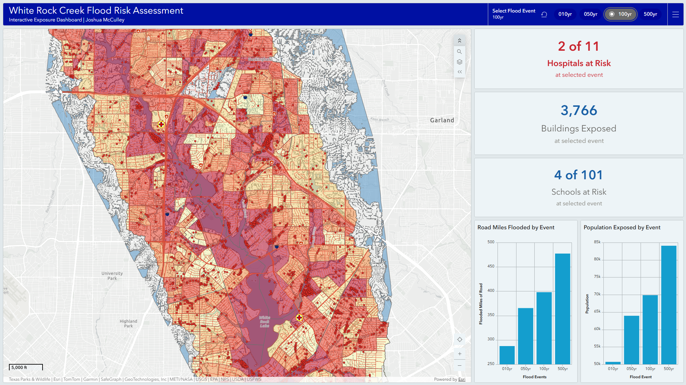

# White Rock Creek Watershed — Flood Risk Assessment

A FEMA-style flood risk assessment of the White Rock Creek watershed (Dallas County, Texas) built with ArcGIS Pro, HEC-RAS 2D hydraulic modeling, and Python/ArcPy — culminating in an interactive, fully synchronized ArcGIS Online dashboard. The project models flooding for four recurrence intervals, quantifies exposure to buildings, population, roads, and critical facilities, and analyzes social vulnerability to identify where flood risk and community vulnerability overlap.

**Author:** Joshua McCulley
**Tools:** ArcGIS Pro · HEC-RAS 7.0.1 (2D) · Python / ArcPy · ArcGIS Online · ArcGIS Dashboards
**Study area:** White Rock Creek Watershed, Dallas County, TX (85.5 sq mi)
**Projection:** NAD83 State Plane Texas North Central (FIPS 4202 / EPSG 2276)

---

## Interactive Dashboard

Explore flood exposure across all four recurrence intervals — a single event selector drives the flood extent, exposed buildings, hospitals, and schools simultaneously:

**[→ Open the White Rock Creek Flood Risk Dashboard](https://utdepps.maps.arcgis.com/apps/dashboards/82ef2c2c39354753b6c0cf1c950ad975#)**

[](https://utdepps.maps.arcgis.com/apps/dashboards/82ef2c2c39354753b6c0cf1c950ad975#)

The dashboard uses a long-format data architecture: each exposed feature carries one record per flood event, enabling cumulative exposure counts through simple categorical filtering. Selecting an event re-filters the flood boundary, all exposure indicators, and the map layers in one action.

---

## Key Findings

| Finding | Result |
|---|---|
| Modeled 100-year inundation | 13,480 acres |
| Population exposed (100-year) | 69,913 (13.8% of 508,251) |
| Buildings exposed (100-year) | 3,766 (3.4% of 110,168) |
| Road miles flooded (100-year) | 398 mi (16.2% of 2,463) |
| **Hospitals in floodplain (100-year)** | **2 of 11 (18%)** |
| Schools in floodplain (100-year) | 4 of 101 (4%) |
| High-vulnerability block groups with >10% flooding | 8 |
| Modeled vs FEMA regulatory floodplain | +7,204 ac (+115%) |

Two hospitals fall within the modeled 100-year floodplain — with the first exposed as early as the 10-year event and a third at the 500-year. Eight socially vulnerable census block groups have more than 10% of their area in the floodplain, indicating disproportionate flood exposure among vulnerable populations.

### Exposure escalation across events

| Event | Inundation (ac) | Buildings | Hospitals | Population |
|---|---|---|---|---|
| 10-year | 9,868 | 1,778 | 1 | 50,745 |
| 50-year | 12,290 | 3,050 | 2 | 63,976 |
| 100-year | 13,480 | 3,766 | 2 | 69,913 |
| 500-year | 16,162 | 6,018 | 3 | 84,131 |

---

## Map Gallery

Six portfolio maps present the assessment from regional context through hazard, validation, exposure, and social equity.

### 1. Study Area

*The 85.5-square-mile White Rock Creek watershed within Dallas County, with stream network, White Rock Lake, and major highways.*

### 2. 100-Year Flood Depth

*Modeled inundation depth for the 1% annual chance event, classified from minor (1-3 ft) to severe (>10 ft).*

### 3. Multi-Frequency Flood Extent

*Nested inundation extents for the 10-, 50-, 100-, and 500-year events, showing how flooding grows with storm severity.*

### 4. Modeled vs FEMA Regulatory Floodplain

*The modeled 100-year floodplain compared against FEMA regulatory zones (A/AE/AO), illustrating the rain-on-grid method's broader capture of pluvial and tributary flooding.*

### 5. Critical Facility & Building Exposure

*Buildings, roads, and critical facilities within the 100-year floodplain, highlighting the two exposed hospitals.*

### 6. Social Vulnerability & Flood Exposure

*Census block group Social Vulnerability Index overlaid with the 100-year floodplain boundary, identifying eight high-vulnerability communities with significant flood exposure.*

---

## Methodology

The assessment followed a nine-phase workflow:

1. **Planning & scoping** — study area, datums, deliverables
2. **Data acquisition** — USGS 3DEP DEM, NHD hydrography, NLCD land cover, US Census ACS demographics, Esri Living Atlas critical facilities, Dallas County building footprints
3. **Geodatabase design** — schema, coded domains, ACS demographic joins
4. **Terrain & watershed delineation** — fill, flow direction/accumulation, watershed delineation from auto-detected pour point
5. **HEC-RAS 2D modeling** — rain-on-grid simulation of 10-, 50-, 100-, and 500-year NOAA Atlas 14 design storms (Diffusion Wave, ~100 ft mesh, 287,909 cells)
6. **Exposure & risk analysis** — building/population/road/facility exposure, Social Vulnerability Index, weighted flood-risk index, mitigation prioritization
7. **Cartography** — six portfolio-grade maps
8. **Interactive web GIS** — multi-event exposure processing, long-format data restructure, and a fully synchronized ArcGIS Dashboards application
9. **Reporting & documentation** — this repository

### Hydraulic Model Configuration

| Parameter | Value |
|---|---|
| Software | HEC-RAS 7.0.1 (2D) |
| Method | Rain-on-grid (direct precipitation) |
| Equation set | Diffusion Wave |
| Mesh | 287,909 cells (~100 ft) |
| Terrain | USGS 3DEP DEM |
| Precipitation | NOAA Atlas 14, SCS Type II, 24-hr |
| Computation interval | 30 sec |
| Simulation window | 48 hr |
| Mass balance error | 0.0085% |

### Design Storm Depths (NOAA Atlas 14, watershed centroid)

| Event | 24-hr Depth |
|---|---|
| 10-year | 6.03 in |
| 50-year | 8.42 in |
| 100-year | 9.55 in |
| 500-year | 12.60 in |

### Modeled vs FEMA Comparison

The modeled 100-year floodplain (13,480 ac) exceeds FEMA's regulatory floodplain (6,276 ac across A/AE/AO zones) by 115%. FEMA's mapping here is almost entirely detailed-study (AE) along main channels; the rain-on-grid model additionally captures pluvial and tributary flooding watershed-wide. The larger extent reflects method scope, not model error — the model agrees with FEMA where FEMA's study is most rigorous.

### Dashboard Data Architecture

The interactive dashboard required restructuring exposure data into **long format**: each exposed feature (building, hospital, school, road segment, block group) carries one record per flood event it is exposed to. Because flooding is cumulative — a structure flooded by the 10-year event is also flooded by all larger events — an exact-match filter on the event field returns cumulative exposure. This enables a single category selector to synchronously filter the flood boundary, three exposure indicators, and all map layers through simple field-matched actions.

---

## Repository Structure

```
white-rock-creek-flood-risk/
├── README.md
├── .gitignore
├── Python/                          # ArcPy processing scripts
│   ├── phase2_data_load.py              # Source data → geodatabase
│   ├── phase3_schema_build.py           # Schema, domains, ACS joins
│   ├── phase4_terrain_processing.py     # Terrain & watershed delineation
│   ├── phase5_process_hecras_outputs.py # HEC-RAS results → depth/extent products
│   ├── phase6_exposure_analysis.py      # Exposure, SVI, risk index
│   ├── phase8_multievent_exposure.py    # Per-event exposure (all layers)
│   ├── phase8_longformat_restructure.py # Long-format dashboard layers
│   ├── add_schools_dynamic.py           # Schools multi-event processing
│   ├── add_road_miles_by_event.py       # Per-event flooded mileage
│   ├── merge_flood_extents.py           # Unified ranked flood extent layer
│   ├── phase9_report_assembly.py        # Documentation generation
│   └── (helper/fix scripts)
├── Maps/                            # Portfolio maps (PDF + PNG) + dashboard preview
├── Report/
│   ├── WhiteRockCreek_FloodRiskAssessment.pdf
│   ├── WhiteRockCreek_FloodRiskAssessment.docx
│   └── Tables/                      # Result tables (CSV)
└── Documentation/
    ├── DataSources.md
    ├── DataDictionary.csv
    └── ProjectMetadata.txt
```

## Data Sources

| Dataset | Provider |
|---|---|
| Digital Elevation Model | USGS 3DEP |
| Hydrography | USGS National Hydrography Dataset (NHD) |
| Land Cover | USGS National Land Cover Database (NLCD) |
| Precipitation | NOAA Atlas 14 Precipitation Frequency |
| Demographics | US Census Bureau ACS 2024 5-Year Estimates |
| Critical Facilities | Esri Living Atlas |
| Building Footprints | Dallas County |
| FEMA Flood Zones | FEMA National Flood Hazard Layer (NFHL) |

Source data and model outputs (DEM, HEC-RAS project, geodatabase) are not hosted in this repository due to size; available on request.

## Limitations

- The rain-on-grid method applies uniform rainfall and does not route external inflows from upstream of the watershed boundary.
- Default Manning's roughness was applied where land-cover-specific values were unavailable.
- A 1.0 ft depth threshold filters shallow surface ponding from reported flood extents; results are sensitive to this choice.
- Building exposure is based on point footprints; partial-flooding nuance at the structure level is not modeled.
- Demographic exposure uses areal weighting of block groups and assumes uniform population distribution within each.
- Dashboard cumulative counts derived from event-rank intersections may differ from per-event report figures by <2% due to boundary-precision effects at flood extent edges.

## License

Shared for portfolio and educational purposes. Data products derive from public sources credited above; consult original providers for their terms of use.

---